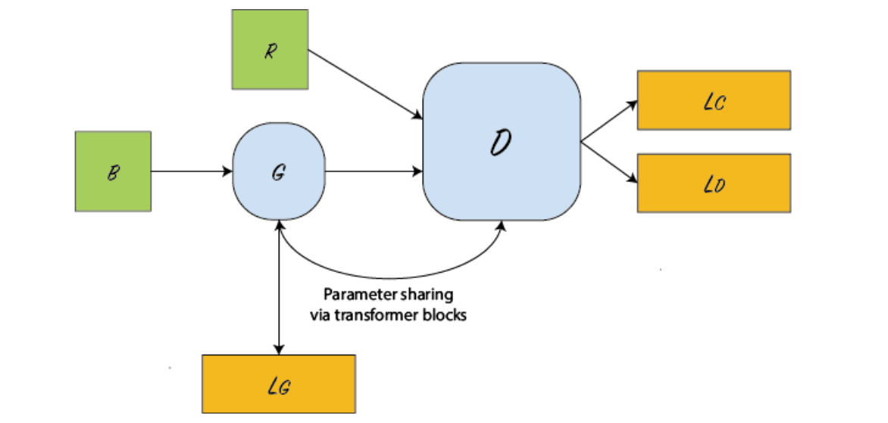

# Visual-Electra
<p align="center">

</p>
Training:

```markdown
python train.py --dataset cifar10 --ent_weight 0.0001  --noise_dim 128  --viz_every 1000 --save_dir ./saved_models --data_aug --dropout .3 --generator_type vera --n_epochs 200 --print_every 100 --lr .00003 --glr .00006 --post_lr .00003 --batch_size 40 --pg_control .1 --decay_epochs 150 175 --warmup_iters 2500 --clf_weight 100. --g_feats 256
```

Our code is based on VERA: https://github.com/wgrathwohl/VERA
